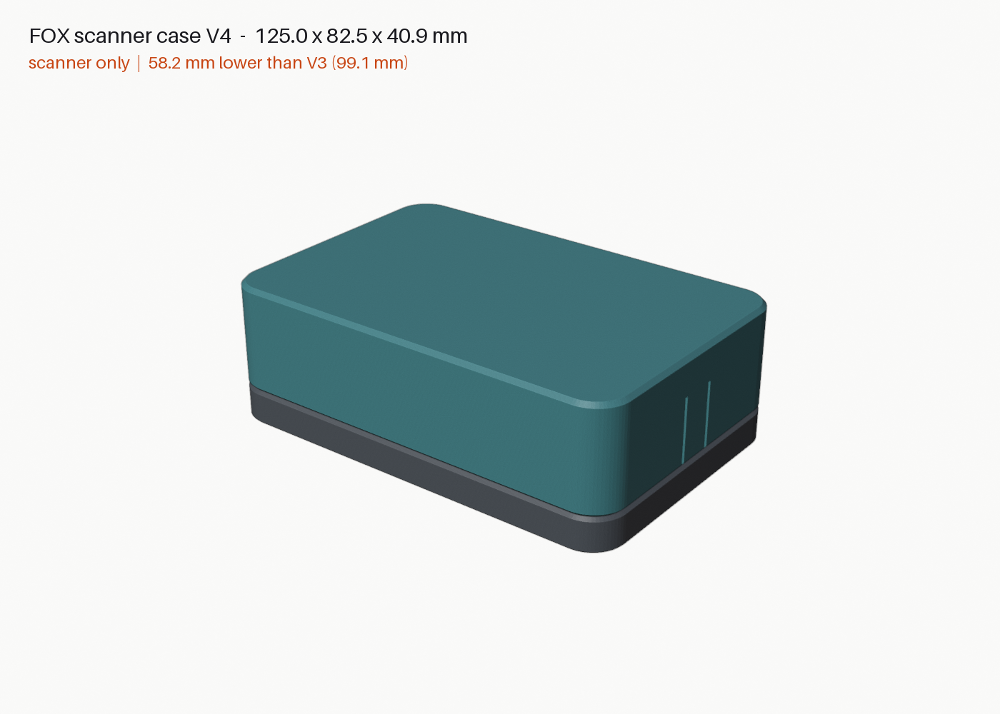
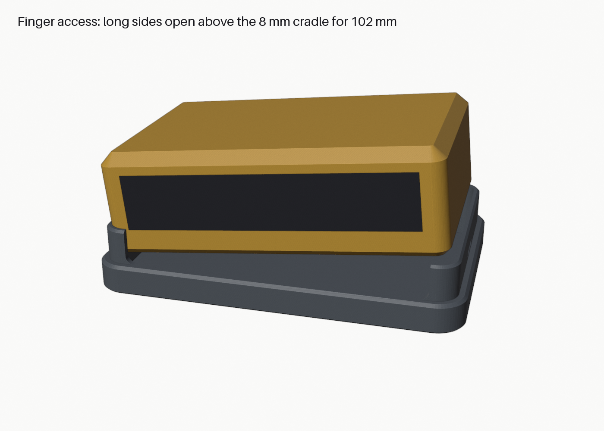
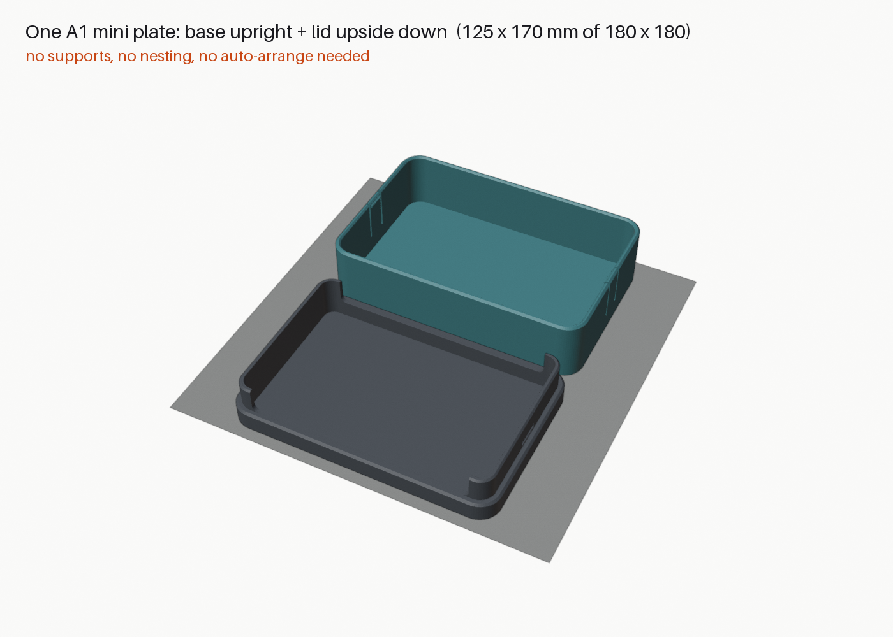

# 3dmakerpro-fox-case

A compact, low-profile, 3D-printable hard case for the **3DMakerpro FOX** scanner body.
V4 is **scanner only**; the cable and charger stay in the original accessory box for now.

| Closed | Lift-out access | One A1 mini plate |
|---|---|---|
|  |  |  |

## Status: V4 modelled and validated in CAD (not yet printed)

| | V4 |
|---|---|
| **Outside** | **125.0 × 82.5 × 40.9 mm** (58 mm lower than the V3 full-kit case) |
| **FOX cavity** | **115.5 × 73.0 mm** (R 5.25), from the physical fit test; 36.5 mm floor → lid ceiling |
| **Clearance** | ~1.5 mm above the FOX (35 mm stand-in); 0.3 mm per side; lens window faces open air |
| **Access** | shallow 8 mm cradle, **102 mm finger windows** on both long sides |
| **Lid** | low sleeve with **2 snap tabs** that click into the base (est. ~22 N to open) |
| **Print** | **one plate, one job, no supports**: base upright + lid upside down |
| **Filament** | ~89–102 g PLA |

Details, height budget, retention, validation and test plan: [`docs/design.md`](docs/design.md).

## Print

Open **`exports/fox_case_v4_A1mini_one_plate.3mf`** in Bambu Studio. The parts are already
placed; don't auto-arrange. Settings: 0.2 mm layers, 3 walls, 15 % infill, supports off, no brim.

Optional first: `exports/fox_fit_test_cradle_ring_v3.stl` (~9 g) to confirm the 73.0 mm width.

## Files

| Path | Contents |
|---|---|
| `scripts/build_fox_case.py` | Parametric build: named parameters; builds, validates, exports STL/3MF, saves the .blend |
| `scripts/run_all.py` / `scripts/render_views.py` / `scripts/annotate_renders.py` | Full pipeline / renders / dimension labels |
| `cad/fox_case.blend` | Editable Blender source |
| `exports/fox_case_v4_{base,lid}.stl` | Parts in print orientation |
| `exports/fox_case_v4_A1mini_one_plate.3mf` / `fox_case_v4_assembled.3mf` | One-plate job / assembled model |
| `exports/validation_report.json` | Parameters, measured dimensions, mesh, support, retention, plate and assembly checks |
| `renders/` | Closed, open, lift-out, exploded, sections, one-plate, snap tab, fit ring |
| `docs/design.md` | V4 design notes |
| `archive/v2`, `archive/v3` | Earlier full-kit (scanner + accessories) versions; also git tags `v1`–`v3` |
| `reference/` | Original photos, fit-test photos, V3 concept, third-party stand (unaltered) |

## Rebuild after changing a parameter

```bash
/Applications/Blender.app/Contents/MacOS/Blender -b cad/fox_case.blend --python scripts/run_all.py
```

```bash
uv run --with pillow python scripts/annotate_renders.py
```

Key parameters: `FOX_CAVITY_LENGTH/WIDTH`, `FOX_INTERNAL_HEIGHT`, `CRADLE_HEIGHT`, `WALL`, `FLOOR`,
`LID_WALL`, `LID_TOP`, `LID_CLEARANCE`, `TOWER_HEIGHT`, `RETENTION_ENGAGEMENT`, `FINGER_WINDOW_LENGTH`,
`PLATE_GAP`. `TOTAL_CASE_HEIGHT` is derived from them.
