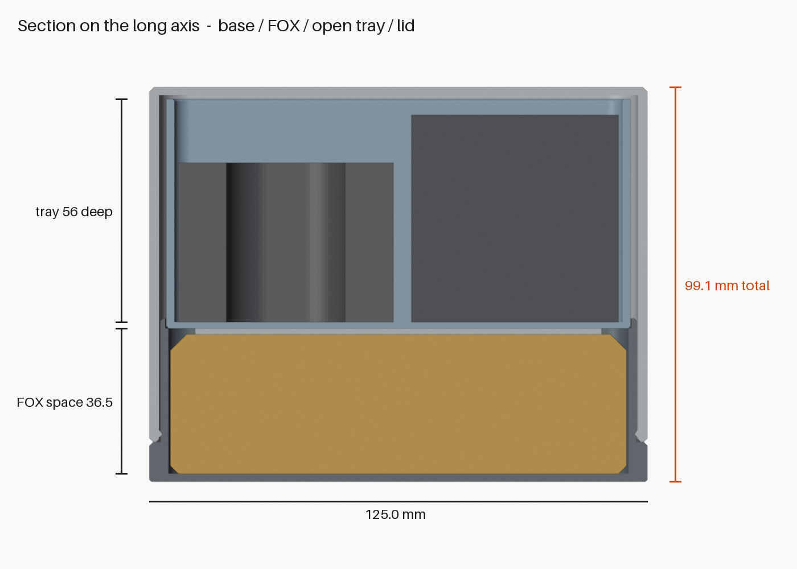
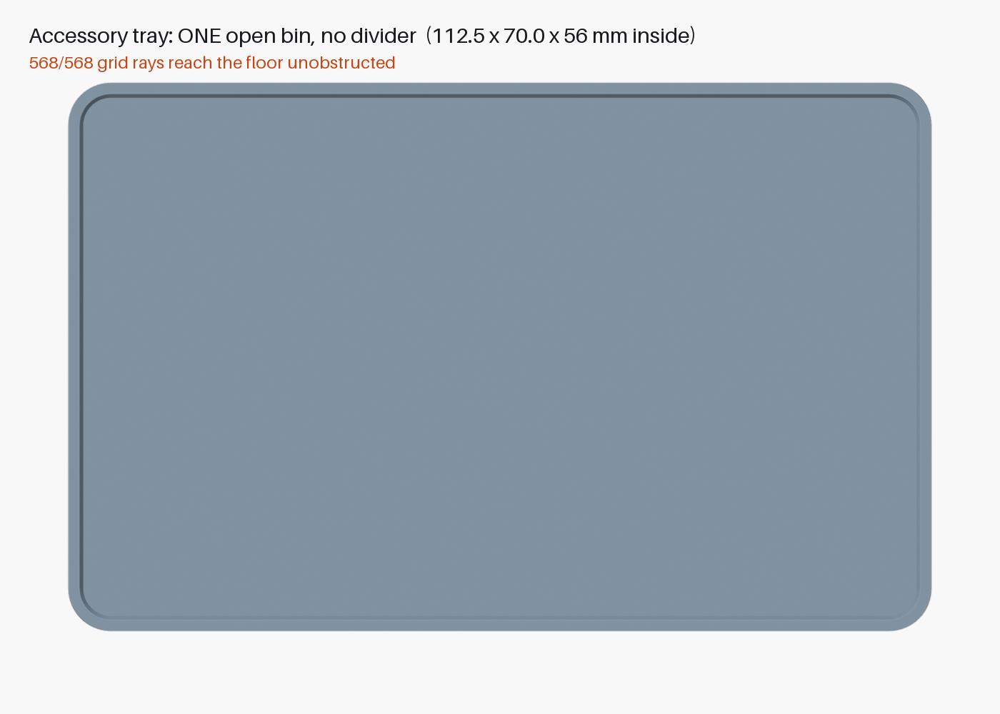

# 3dmakerpro-fox-case

A compact, rigid, 3D-printable carrying case for the **3DMakerpro FOX** scanner that keeps the
scanner, its **cable and its charger** together. Pick up one case and you have everything.

| Closed | Section | Tray: one open bin |
|---|---|---|
|  |  |  |

## Status: V3 modelled and validated in CAD; FOX cavity physically fit-tested (V2 ring)

| | V3 |
|---|---|
| **Outside** | **125.0 × 82.5 × 99.1 mm** (31.4 mm lower than V2) |
| **FOX cavity** | **115.5 × 73.0 mm** (R 5.25), from the printed fit test; 36.5 mm vertical space |
| **Accessory tray** | **112.5 × 70.0 × 56 mm inside, one open bin, no divider** |
| **Lid** | slip-over sleeve with **2 snap tabs** that click into the base |
| **Print** | **2 jobs, no supports**: A = base + tray, B = lid (upside down) |
| **Material** | ≈ 195–225 g PLA (249 g solid-equivalent) |

Stacked, bottom to top: **base** with a shallow FOX cradle (finger access on both long sides) →
**FOX** → **open accessory tray** (charger + freely coiled cable) → **lid**.
Details, height budget, validation and test plan: [`docs/design.md`](docs/design.md).

## Print

1. `exports/fox_case_v3_plate_A_base_and_tray.3mf`: base and tray, both upright.
2. `exports/fox_case_v3_plate_B_lid.3mf`: lid, upside down.
3. Optional: `exports/fox_fit_test_cradle_ring_v3.stl` (~9 g) to confirm the new 73.0 mm width.

Settings: 0.2 mm layers, 3 walls, 15 % infill, supports off, no brim needed.

## Files

| Path | Contents |
|---|---|
| `scripts/build_fox_case.py` | Parametric build: named parameters; builds, validates, exports STL/3MF, saves the .blend |
| `scripts/render_views.py` / `scripts/run_all.py` | Documentation renders / full build + render pipeline |
| `scripts/annotate_renders.py` | Stamps final dimensions onto the renders |
| `cad/fox_case.blend` | Editable Blender source |
| `exports/fox_case_v3_{base,accessory_tray,lid}.stl` | Parts in print orientation |
| `exports/fox_case_v3_plate_*.3mf` / `fox_case_v3_assembled.3mf` | Print plates / assembled model |
| `exports/validation_report.json` | Parameters, dimensions, mesh, support, retention, assembly checks |
| `renders/` | Closed, open, tray installed, exploded, section, no-divider proof, snap tab, plates |
| `docs/design.md` | Evidence, height budget, architecture, retention, printing, validation, test plan |
| `archive/v2/` | V2 printable files and renders (V1/V2 also tagged in git) |
| `reference/` | Original photos, third-party stand STL and screenshot (unaltered) |

## Rebuild after changing a parameter

```bash
/Applications/Blender.app/Contents/MacOS/Blender -b cad/fox_case.blend --python scripts/run_all.py
```

```bash
uv run --with pillow python scripts/annotate_renders.py
```

Key parameters: `FOX_CAVITY_LENGTH/WIDTH`, `FOX_INTERNAL_HEIGHT`, `ACCESSORY_TRAY_HEIGHT`, `WALL`,
`FLOOR`, `LID_CLEARANCE`, `TRAY_CLEARANCE`, `LID_RETENTION`. `TOTAL_CASE_HEIGHT` is derived from them.
