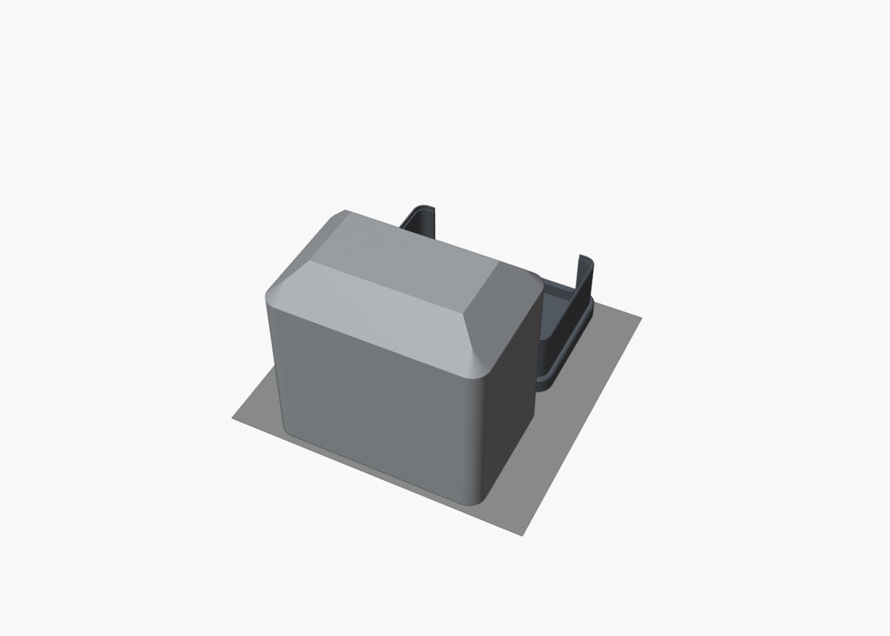
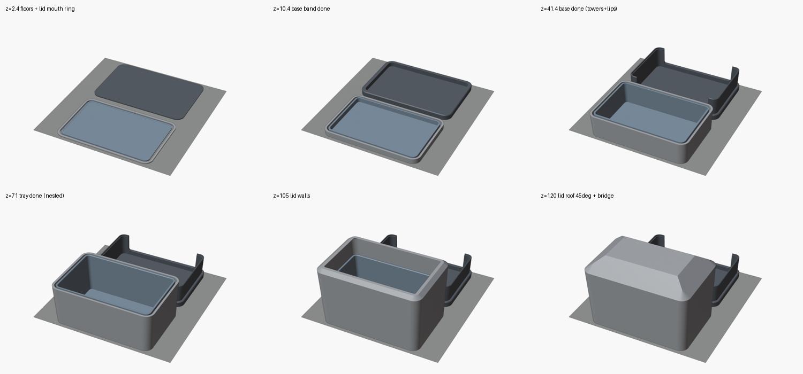

# 3dmakerpro-fox-case

A compact, rigid, 3D-printable carrying case for the **3DMakerpro FOX** scanner that keeps the
scanner **and** its charger and cable together. Pick up one case and you have everything.

**The whole case prints in one job on one Bambu A1 mini plate, with no supports.**

| Closed | One A1 mini plate | Layer by layer |
|---|---|---|
|  |  |  |

## Status: V2 modelled, validated in CAD, not yet printed

* **Stacked layout:** base with a shallow FOX cradle → accessory tray → lid.
* **Outside size:** 125 × 82 × 130.5 mm.
* **Scanner cavity:** 115.5 × 72.5 mm (R 5.25). Clearance is 1.25 mm per side and 1.5 mm above.
  Both long sides are open above an 8 mm cradle so you can grip the FOX.
* **Accessory tray:** 538.7 cm³, which matches the original black accessory box.
* **Printing:** the lid prints mouth-down with a self-supporting 45° roof and a 40 mm bridge. That
  frees the bed inside it, so **the tray prints nested inside the lid**. Plate = base + (lid with tray).
* Watertight meshes, no clashes, and support-free. See [`docs/design.md`](docs/design.md) for the
  build-up order, slicer settings (per-object brim, **no auto-arrange**) and validation.

**Print this first:** [`exports/fox_fit_test_cradle_ring.stl`](exports/fox_fit_test_cradle_ring.stl)
(~9 g). It checks the FOX cavity before the long print. Then print
[`exports/fox_case_A1mini_one_plate.3mf`](exports/fox_case_A1mini_one_plate.3mf).

## Files

| Path | Contents |
|---|---|
| `scripts/build_fox_case.py` | Parametric build: named parameters; builds parts, validates, exports STL and 3MF, saves the .blend |
| `scripts/render_views.py` | Documentation renders, including the plate and print-progress views |
| `cad/fox_case.blend` | Editable Blender source |
| `exports/fox_case_A1mini_one_plate.3mf` / `.stl` | **The whole case, pre-arranged on one A1 mini plate** |
| `exports/fox_case_{base,accessory_tray,lid}.stl` | Individual parts in print orientation |
| `exports/fox_fit_test_cradle_ring.stl` | Cheap cavity fit test |
| `exports/validation_report.json` | Parameters, dimensions, mesh, support, plate and assembly checks |
| `renders/` | Closed, open, cradle, tray, exploded, section, fit-test, plate and print-progress views |
| `docs/design.md` | Evidence, layout study, print strategy, dimensions, uncertainties, test plan |
| `reference/` | Your photos, the third-party stand STL and its screenshot (unaltered) |

## Rebuild after changing a parameter

```bash
/Applications/Blender.app/Contents/MacOS/Blender -b --python scripts/build_fox_case.py
```

Or run `exec(open("scripts/build_fox_case.py").read())` in Blender (or through the Blender MCP),
then `scripts/render_views.py` for the images.

The third-party stand in `reference/third_party/` (MakerWorld, "Tacco25") is used only as
measurement evidence. None of its geometry is copied into this case.
